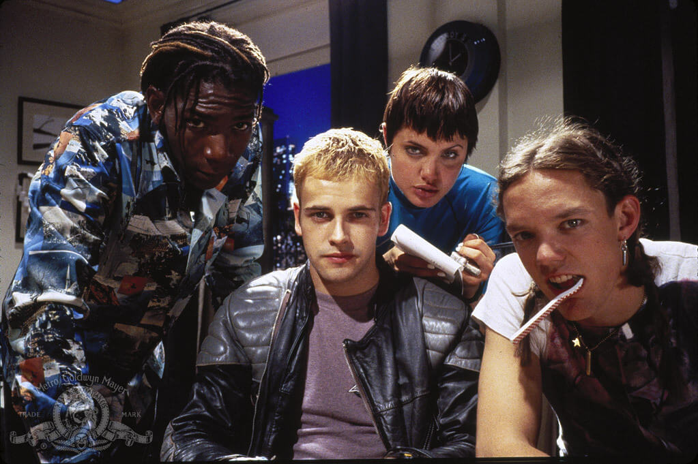

# Hackers, The Unofficial Movie API

An API based on the 1995 movie Hackers. Get information on characters, organizations, hacks, quotes, and more. Inspired by the continued work of [Cyberdelia NYC](https://www.cyberdelianyc.com/). Hack the planet!



## Table of Contents

- [Getting Started](#getting-started)
- [Prerequisites](#prerequisites)
- [Installation](#installing)

## Getting Started

These instructions will get you a copy of the project up and running on your local machine for development and testing purposes.

### Prerequisites

- Node.js
- npm

### Installing

1. Clone the repository

```sh
git clone https://github.com/internetdrew/hackers-the-api.git
```

2. Install NPM packages

```sh
npm install
```

Built With

- [Node.js](https://nodejs.org/)
- [Express.js](https://expressjs.com/)
- [Prisma](https://www.prisma.io/)

Monitored With

- [Morgan](https://github.com/expressjs/morgan)

Tested With

- [SuperTest](https://www.npmjs.com/package/supertest)
- [Vitest](https://vitest.dev/)
